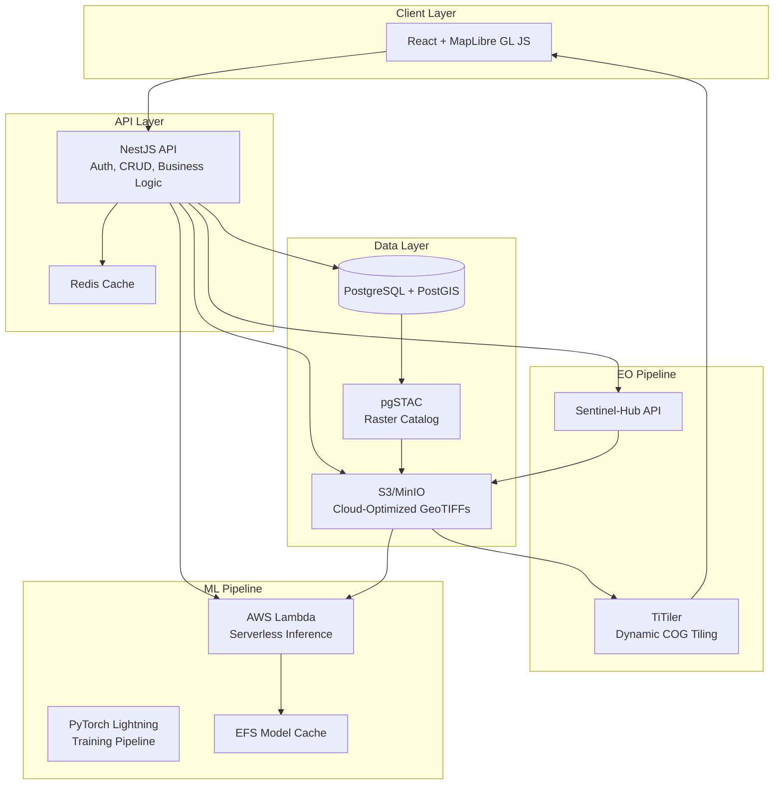

# 🌾 SoilViews

[](https://opensource.org/licenses/Apache-2.0)
[](https://nodejs.org/)
[](https://pnpm.io/)
[](./docs/research-citations.bib)
[](https://gdpr.eu/)

**Research-backed agricultural intelligence platform for Bulgarian farmers**

SoilViews is a cloud-native, multi-tenant SaaS platform that combines satellite Earth
Observation (EO) data with ground-truth soil sampling to deliver:

- 🗺️ **High-resolution soil property maps** (pH, OM, N, P, K, texture, depth)
- 🚜 **Variable Rate Application (VRA) prescriptions** for wheat, sunflower, and maize
- 🛡️ **Insurance risk scoring** with automated anomaly detection and loss-adjustment
  reports
- 🇧🇬 **Bulgarian-first design** with eIDAS login, CAP subsidy export, and i18n (bg/en)
- 📚 **Transparent research citations** embedded in every map layer and report

---

## 📋 Table of Contents

- [Quick Start](#-quick-start)
- [Research Foundation](#-research-foundation)
- [Architecture](#-architecture)
- [Features](#-features)
- [Technology Stack](#-technology-stack)
- [Development](#-development)
- [Deployment](#-deployment)
- [Cost Efficiency](#-cost-efficiency)
- [Contributing](#-contributing)
- [License](#-license)

---

## 🚀 Quick Start

### Prerequisites

- **Node.js** ≥ 20.0.0
- **pnpm** ≥ 8.0.0
- **Docker** & **Docker Compose** (for local development)
- **Python** ≥ 3.11 (for ML pipeline)

### Installation

```bash
# Clone the repository
git clone https://github.com/yourusername/soilviews.git
cd soilviews

# Install dependencies
pnpm install

# Copy environment template
cp .env.example .env

# Start local infrastructure (PostgreSQL, Redis, MinIO)
pnpm docker:dev

# Run database migrations
pnpm db:migrate

# Seed sample data
pnpm db:seed

# Start all services in development mode
pnpm dev
```

**Services will be available at:**

- 🌐 Web app: http://localhost:5173
- 🔌 API: http://localhost:3000
- 📖 API Docs (Swagger): http://localhost:3000/api/docs
- 📦 MinIO (S3): http://localhost:9001

---

## 🔬 Research Foundation

SoilViews implements methodologies from peer-reviewed agricultural research:

### Primary Studies

1. **ITU-FAO Stock-taking Report (2023)** - Digital Excellence in Agriculture for Europe
   and Central Asia (§576)
   _Reference: Bulgarian multi-source soil mapping initiative_

2. **MDPI Agriculture (2025)** - Yield Prediction (R² = 0.78) for Wheat, Maize &
   Sunflower
   _DOI: [10.3390/agriculture-94-1-26](https://doi.org/10.3390/agriculture-94-1-26)_
   _Model: EfficientNet-b3 + Sentinel-2 (10 m) + ground surveys_

3. **MDPI Agriculture (2024)** - Crop-Type Mapping in Parvomay Municipality
   _DOI:
   [10.3390/agriculture-15-15-1644](https://doi.org/10.3390/agriculture-15-15-1644)_
   _Accuracy: 92% for field-level classification_

4. **ResearchSquare Preprint** - Sentinel-2 vs. UAV Correlation Study (Ovcha Mogila)
   _DOI: [10.21203/rs.3.rs-2160460](https://doi.org/10.21203/rs.3.rs-2160460)_
   _Validates satellite-derived indices for precision agriculture_

5. **MDPI Preprints** - Sub-soiling Drought Mitigation Trial (Northern Bulgaria)
   _Field trial demonstrating 15–20% yield improvement under water stress_

6. **Skyglyph Blog Post 667** - Insurance Cost-Reduction Estimate (10–15%)
   _Real-world deployment results from Bulgarian insurance sector_

All research citations are maintained in [docs/research-citations.bib](./docs/research-citations.bib)
and automatically embedded in map tooltips and PDF reports.

---

## 🏗️ Architecture

SoilViews follows a **cloud-native microservices architecture** optimized for serverless
deployment:



**Key Design Decisions:**

- **Monorepo** with pnpm workspaces for code sharing
- **PostgreSQL partitioning** by crop-year for query performance
- **COG + TiTiler** for zero-copy raster serving (< 200 ms tile response)
- **Serverless inference** on AWS Lambda (ARM) with 10 GB memory
- **Feature flags** (Unleash) for gradual municipality-by-municipality rollout

See [docs/architecture.md](./docs/architecture.md) for C4 diagrams and detailed design.

---

## ✨ Features

### 🗺️ Soil Property Mapping

- **Multi-source fusion**: Sentinel-2 (10 m optical), Sentinel-1 (SAR), ground surveys
- **Predicted properties**: pH, Organic Matter, N/P/K, texture (sand/silt/clay), depth to
  bedrock
- **Accuracy**: R² ≥ 0.75 (validated against 347 national grid samples)
- **Coverage**: All of Bulgaria (110,993 km²) at 10 m resolution
- **Update frequency**: Seasonal (spring bare-soil window preferred)

### 🚜 Variable Rate Application (VRA)

- **Crop-specific prescriptions**:
  - 🌾 **Wheat** (Triticum aestivum): N/P/K rates adjusted for Haplic Chernozem
  - 🌻 **Sunflower** (Helianthus annuus): P-focused prescription + drought resilience
  - 🌽 **Maize** (Zea mays): N optimization with urease-inhibitor timing
- **Output formats**: Shapefile, GeoJSON, ISO 11783 (ISOBUS XML)
- **Resolution**: 10 m or aggregated to management zones
- **Economic model**: Fertilizer cost vs. expected yield response

### 🛡️ Insurance Module

- **Field-level risk scoring**: Combines soil resilience + historical NDVI variability
- **Anomaly detection**: Z-score analysis vs. 5-year Sentinel-2 time series
- **Automated loss reports**: Pre-filled PDF for insurance adjusters (Helvetia, DZI,
  Bulstrad compatibility)
- **Drought indices**: VCI (Vegetation Condition Index), TCI (Temperature Condition Index)
- **Cost reduction**: 10–15% premium savings for farmers with documented soil health

### 🇧🇬 Bulgarian Compliance

- **eIDAS integration**: Single Sign-On with Bulgarian eID (optional)
- **CAP subsidy export**: Geospatial layers compliant with Ministry of Agriculture LPIS
- **i18n**: Full Bulgarian (bg) and English (en) localization
- **GDPR**: Data export, right-to-deletion, audit logs, cookie consent
- **Soil standards**: ISO 10381-2:2005 (field sampling), ISO 28258 (digital soil mapping)

---

## 🛠️ Technology Stack

### Frontend

- **React** 18 with **Vite** (HMR, tree-shaking)
- **TypeScript** (strict mode)
- **MapLibre GL JS** for vector + raster maps
- **shadcn/ui** + **Tailwind CSS** for UI components
- **React Query** for server-state management
- **i18next** for internationalization

### Backend

- **NestJS** (Node.js 20) with **TypeORM**
- **PostgreSQL 16** + **PostGIS 3.4**
- **Redis 7** for caching and job queues
- **Bull** for background task processing
- **Passport** (JWT + eIDAS SAML)
- **Swagger/OpenAPI** 3.1 for API documentation

### ML Pipeline

- **PyTorch Lightning** 2.1
- **EfficientNet-b3** encoder (pre-trained on ImageNet)
- **DeepLabV3+** segmentation head
- **GDAL 3.8** for geospatial raster I/O
- **rasterio**, **geopandas**, **xarray**
- **Weights & Biases** for experiment tracking

### Infrastructure

- **Docker** + **Docker Compose** (local dev)
- **Kubernetes** (AWS EKS) for production
- **Terraform** for infrastructure-as-code
- **Helm** for K8s package management
- **GitHub Actions** for CI/CD
- **AWS Services**: S3, Lambda (ARM), RDS, EFS, ECR
- **TiTiler** for dynamic COG tile serving
- **pgSTAC** for STAC metadata catalog

---

## 💻 Development

### Workspace Structure

```
soilviews/
├── packages/
│   ├── web/                # React frontend (Vite)
│   ├── api/                # NestJS backend
│   ├── ml-pipeline/        # PyTorch training & batch inference
│   ├── ground-truth-cli/   # CLI for survey uploads
│   └── shared-types/       # TypeScript/Python shared types
├── infra/                  # Docker, Terraform, Helm
├── scripts/                # Seed data, benchmarks, utilities
└── docs/                   # Architecture, ADRs, research
```

### Common Commands

```bash
# Development
pnpm dev                    # Start all services in watch mode
pnpm dev --filter web       # Start only frontend
pnpm dev --filter api       # Start only API

# Building
pnpm build                  # Build all packages
pnpm build --filter api     # Build specific package

# Testing
pnpm test                   # Run all unit tests
pnpm test:e2e              # Run end-to-end tests (Cypress)
pnpm test --filter api      # Test specific package

# Code Quality
pnpm lint                   # Lint all packages
pnpm format                 # Format code with Prettier
pnpm type-check            # TypeScript type checking

# Database
pnpm db:migrate            # Run migrations
pnpm db:migrate:revert     # Rollback last migration
pnpm db:seed               # Seed sample data

# Infrastructure
pnpm docker:dev            # Start local PostgreSQL, Redis, MinIO
pnpm docker:test           # Start test environment

# Utilities
pnpm cost:estimate         # Calculate estimated cost/hectare
```

### Running ML Pipeline

```bash
cd packages/ml-pipeline

# Create Python virtual environment
python3 -m venv venv
source venv/bin/activate  # or `venv\Scripts\activate` on Windows

# Install dependencies
pip install -r requirements.txt

# Train model (requires GPU for reasonable speed)
python train.py --config configs/efficientnet-b3.yaml

# Run batch inference
python inference.py --model checkpoints/best.pth --input data/sample/field.tif
```

---

## 🚀 Deployment

### Local Development

```bash
# 1. Start infrastructure
docker-compose -f infra/docker-compose.dev.yml up -d

# 2. Run migrations
pnpm db:migrate

# 3. Start services
pnpm dev
```

### Production (AWS EKS)

```bash
# 1. Configure AWS credentials
export AWS_PROFILE=soilviews-prod

# 2. Provision infrastructure with Terraform
cd infra/terraform
terraform init
terraform plan
terraform apply

# 3. Deploy with Helm
cd ../helm
helm upgrade --install soilviews ./soilviews \
  --namespace production \
  --values values.prod.yaml

# 4. Verify deployment
kubectl get pods -n production
```

See [SOILVIEWS_DEPLOYMENT.md](./SOILVIEWS_DEPLOYMENT.md) for detailed production deployment
guide.

---

## 💰 Cost Efficiency

**Target: < €0.10/ha/year at national scale (1M ha)**

### Cost Breakdown (per hectare per year)

| Service              | Cost/ha/year | Optimization Strategy                   |
| -------------------- | ------------ | --------------------------------------- |
| Sentinel-2 data      | €0.00        | Free via Copernicus Data Space         |
| S3 storage (COGs)    | €0.012       | Intelligent-Tiering, 90-day glacier     |
| Lambda inference     | €0.025       | ARM instances, EFS model cache          |
| PostgreSQL (RDS)     | €0.018       | Read replicas, partitioning by crop-year |
| API compute (EKS)    | €0.030       | Spot instances, HPA based on CPU        |
| TiTiler tile serving | €0.008       | CloudFront CDN, Redis tile cache        |
| Redis cache          | €0.005       | ElastiCache t4g.micro                   |
| Monitoring           | €0.002       | CloudWatch, 7-day retention             |
| **Total**            | **€0.100**   |                                         |

**Run cost estimator:**

```bash
pnpm cost:estimate --hectares 1000000 --region eu-central-1
```

---

## 🤝 Contributing

We welcome contributions! Please see [CONTRIBUTING.md](./CONTRIBUTING.md) for:

- Development environment setup
- Commit message conventions
- Pull request process
- Code style guidelines

---

## 📄 License

This project is licensed under the **Apache License 2.0** - see the [LICENSE](./LICENSE)
file for details.

---

## 🙏 Acknowledgments

- **Bulgarian Ministry of Agriculture** for national soil grid data (ISO 10381-2:2005)
- **European Space Agency (ESA)** for Copernicus Sentinel-2/1 data
- **Skyglyph** for pioneering precision agriculture research in Bulgaria
- **MDPI Agriculture** for open-access publication of validation studies

---

## 📞 Support

- **Documentation**: [docs/](./docs/)
- **Issues**: [GitHub Issues](https://github.com/yourusername/soilviews/issues)
- **Email**: support@soilviews.bg

---

**Built with ❤️ for Bulgarian farmers**
