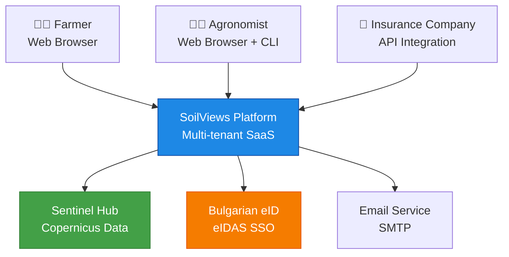
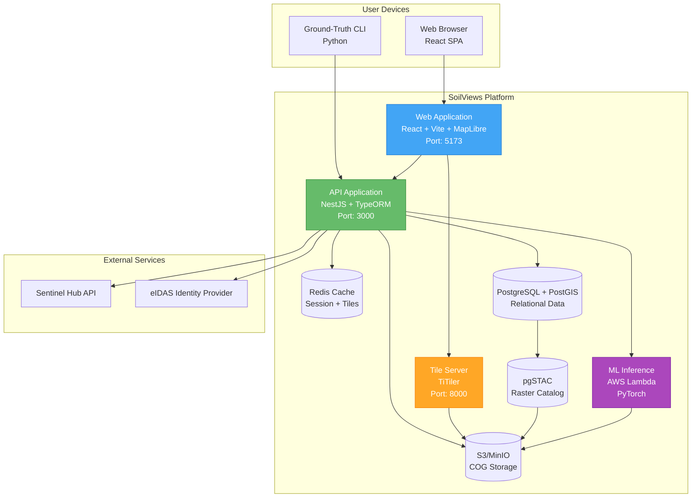
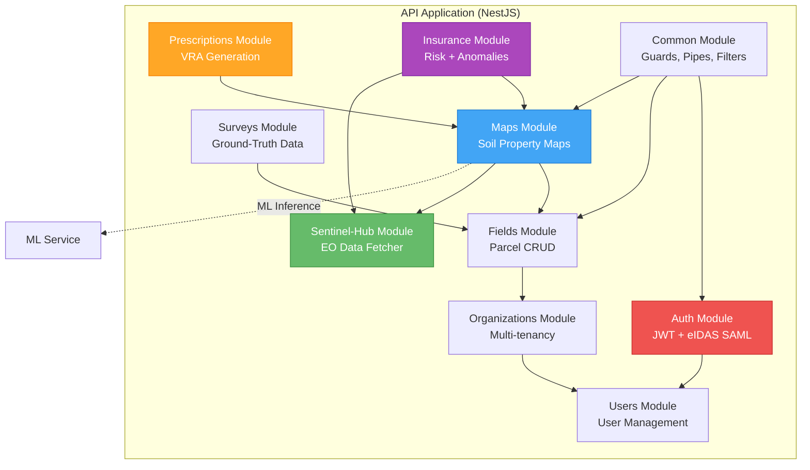
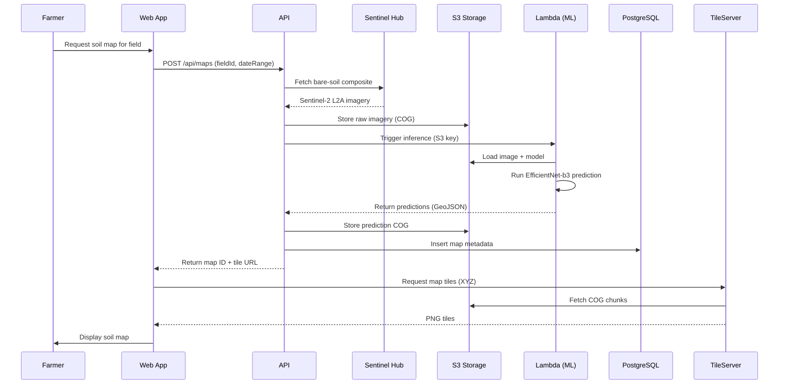
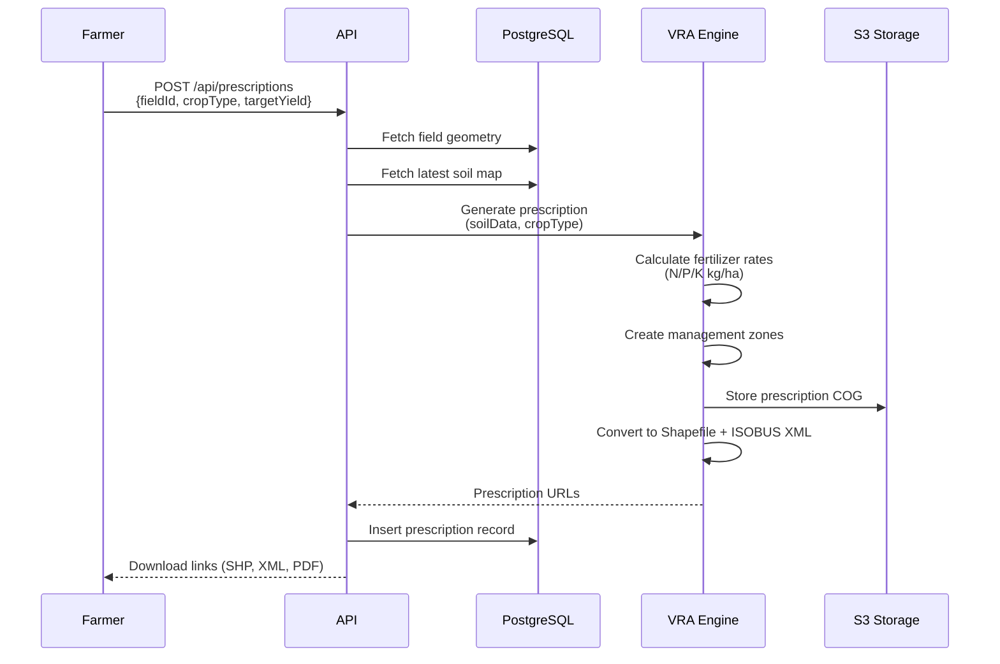
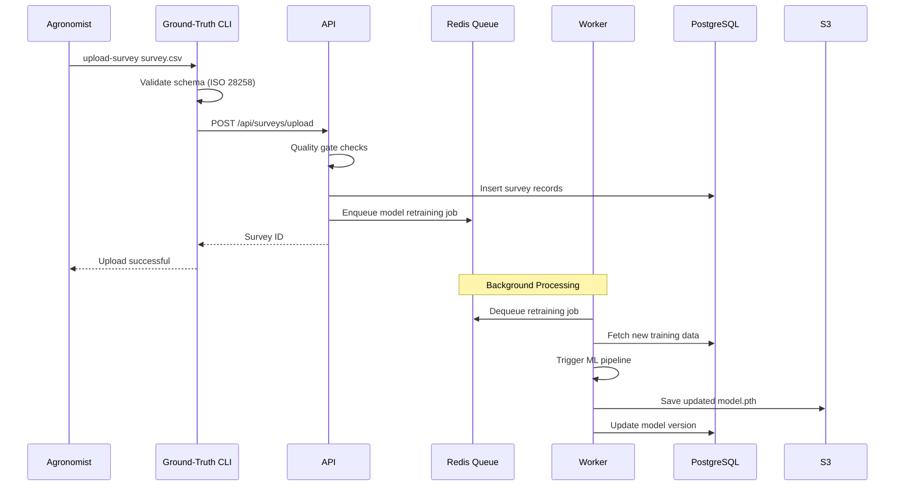
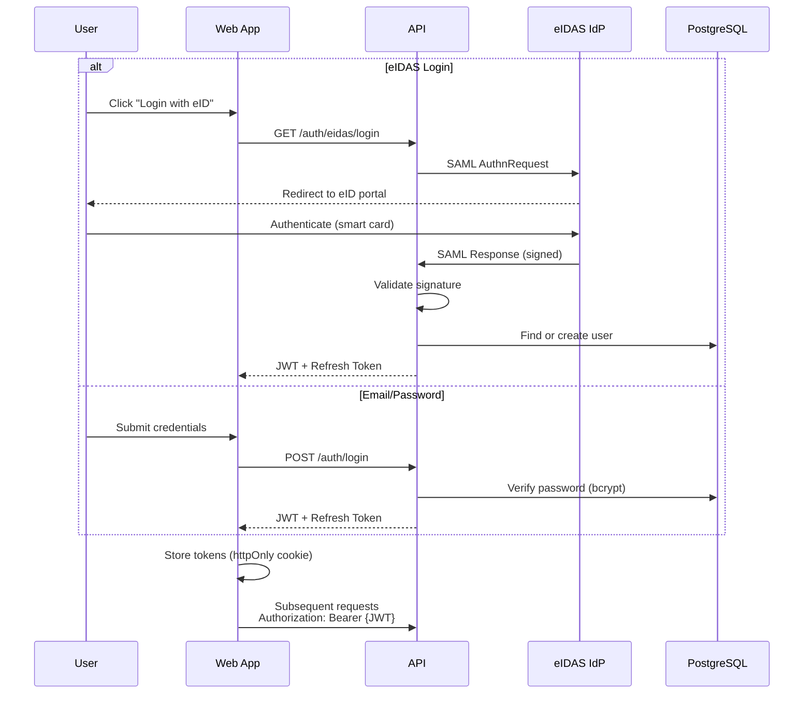
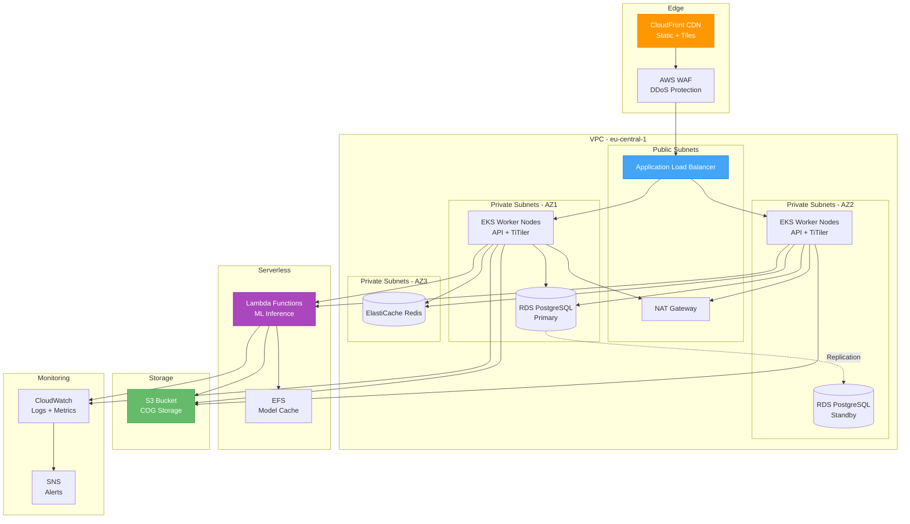

# SoilViews System Architecture

## Table of Contents

- [Overview](#overview)
- [C4 Model Diagrams](#c4-model-diagrams)
- [Technology Stack](#technology-stack)
- [Data Flow](#data-flow)
- [Security Architecture](#security-architecture)
- [Deployment Architecture](#deployment-architecture)
- [Scalability Considerations](#scalability-considerations)

---

## Overview

SoilViews is a cloud-native, multi-tenant SaaS platform designed for precision agriculture
in Bulgaria. The system architecture follows microservices principles with clear separation
of concerns:

- **Frontend (Web)**: React SPA with MapLibre GL JS for geospatial visualization
- **Backend (API)**: NestJS REST API with PostgreSQL/PostGIS persistence
- **ML Pipeline**: PyTorch Lightning training + AWS Lambda serverless inference
- **Data Pipeline**: Sentinel-Hub integration for Earth Observation data acquisition
- **Storage**: S3-compatible object storage for Cloud-Optimized GeoTIFFs (COGs)

---

## C4 Model Diagrams

### Level 1: System Context



### Level 2: Container Diagram



### Level 3: Component Diagram (API Application)



---

## Technology Stack

### Frontend

| Layer               | Technology                 | Purpose                              |
| ------------------- | -------------------------- | ------------------------------------ |
| Framework           | React 18                   | UI component library                 |
| Build Tool          | Vite                       | Fast HMR & optimized production      |
| Language            | TypeScript 5.3             | Type safety                          |
| State Management    | React Query + Zustand      | Server state + client state          |
| Routing             | React Router 6             | SPA navigation                       |
| Maps                | MapLibre GL JS             | WebGL raster + vector rendering      |
| UI Components       | shadcn/ui + Tailwind       | Accessible component library         |
| Forms               | React Hook Form + Zod      | Form validation                      |
| Internationalization| i18next                    | Bulgarian/English localization       |
| Charts              | Recharts                   | Data visualization                   |

### Backend

| Layer           | Technology          | Purpose                            |
| --------------- | ------------------- | ---------------------------------- |
| Framework       | NestJS 10           | Enterprise Node.js framework       |
| Language        | TypeScript 5.3      | Type safety                        |
| ORM             | TypeORM 0.3         | Database abstraction               |
| Database        | PostgreSQL 16       | Relational data                    |
| Spatial Ext.    | PostGIS 3.4         | Geospatial queries                 |
| Cache           | Redis 7             | Session, rate limiting, tile cache |
| Auth            | Passport (JWT+SAML) | Authentication & authorization     |
| Validation      | class-validator     | DTO validation                     |
| API Docs        | Swagger/OpenAPI 3.1 | Auto-generated documentation       |
| Queue           | Bull (Redis)        | Background job processing          |
| File Storage    | AWS SDK (S3)        | Object storage abstraction         |

### ML Pipeline

| Layer            | Technology               | Purpose                         |
| ---------------- | ------------------------ | ------------------------------- |
| Framework        | PyTorch Lightning 2.1    | Training orchestration          |
| Model Arch       | EfficientNet-b3          | CNN encoder (ImageNet pretrain) |
| Segmentation     | DeepLabV3+               | Dense prediction head           |
| Geospatial I/O   | GDAL 3.8, rasterio       | COG reading/writing             |
| Data Processing  | NumPy, xarray, geopandas | Array manipulation              |
| Experiment Track | Weights & Biases         | Hyperparameter tuning           |
| Inference        | TorchScript + ONNX       | Optimized production models     |
| Serverless       | AWS Lambda (ARM)         | On-demand inference             |

### Infrastructure

| Layer          | Technology        | Purpose                       |
| -------------- | ----------------- | ----------------------------- |
| Containerization | Docker          | Application packaging         |
| Orchestration  | Kubernetes (EKS)  | Container orchestration       |
| IaC            | Terraform         | Infrastructure provisioning   |
| Package Mgmt   | Helm 3            | Kubernetes deployments        |
| CI/CD          | GitHub Actions    | Automated pipelines           |
| Monitoring     | CloudWatch        | Logs, metrics, alarms         |
| Tracing        | OpenTelemetry     | Distributed tracing           |
| Tile Server    | TiTiler (FastAPI) | Dynamic COG tiling            |
| Object Storage | S3 / MinIO        | COG storage                   |
| CDN            | CloudFront        | Static asset + tile caching   |

---

## Data Flow

### 1. Soil Property Map Generation



### 2. VRA Prescription Workflow



### 3. Ground-Truth Data Ingestion



---

## Security Architecture

### Authentication Flow



### Authorization Model

```
┌─────────────────────────────────────────┐
│         Role-Based Access Control       │
├─────────────┬───────────────────────────┤
│ Role        │ Permissions               │
├─────────────┼───────────────────────────┤
│ SUPER_ADMIN │ All permissions           │
│ ORG_ADMIN   │ Manage org users + fields │
│ AGRONOMIST  │ Upload surveys, create    │
│             │ maps + prescriptions      │
│ FARMER      │ View own fields, download │
│             │ prescriptions             │
│ VIEWER      │ Read-only access          │
└─────────────┴───────────────────────────┘
```

**Multi-tenancy Isolation:**

- Row-Level Security (RLS) in PostgreSQL
- Every query filtered by `organizationId`
- S3 bucket prefixes per organization
- Redis cache keys namespaced by org

### Data Protection

- **At Rest**: AES-256 encryption (RDS, S3)
- **In Transit**: TLS 1.3 for all connections
- **Secrets**: AWS Secrets Manager / HashiCorp Vault
- **PII**: Pseudonymization for GDPR compliance
- **Audit Logs**: Immutable append-only table

---

## Deployment Architecture

### AWS Production Architecture



### Environment Strategy

| Environment | Purpose               | Infrastructure         | Cost    |
| ----------- | --------------------- | ---------------------- | ------- |
| Development | Local dev (Docker)    | docker-compose         | €0/mo   |
| Staging     | Pre-production tests  | EKS t3.medium x 2      | €150/mo |
| Production  | Live traffic          | EKS m5.large x 3 + RDS | €800/mo |

---

## Scalability Considerations

### Horizontal Scaling

- **API Pods**: HorizontalPodAutoscaler (CPU > 70% → scale up)
- **TiTiler**: Separate deployment with aggressive caching
- **PostgreSQL**: Read replicas for reporting queries
- **Lambda**: Concurrent execution limit (default: 1000)

### Database Optimization

- **Partitioning**: `fields`, `surveys`, `maps` by `crop_year`
- **Indexing**: GiST on geometry columns, B-tree on foreign keys
- **Connection Pooling**: pgBouncer (transaction mode)
- **Query Caching**: Redis for frequently accessed aggregations

### Cost Optimization

- **Spot Instances**: 70% of EKS nodes (non-critical workloads)
- **S3 Lifecycle**: COGs > 90 days → Intelligent-Tiering
- **Lambda Reserved Concurrency**: Prevent runaway costs
- **CloudFront**: Reduce origin requests by 80%

### Performance Targets

| Metric                   | Target   | Measurement                         |
| ------------------------ | -------- | ----------------------------------- |
| API P95 Response Time    | < 200 ms | CloudWatch Insights                 |
| Map Tile Load Time       | < 500 ms | Browser Performance API             |
| ML Inference (1 field)   | < 30 s   | Lambda duration metric              |
| Database Query P99       | < 100 ms | pg_stat_statements                  |
| Uptime                   | 99.9%    | StatusPage.io                       |

---

## Disaster Recovery

- **RTO (Recovery Time Objective)**: 4 hours
- **RPO (Recovery Point Objective)**: 15 minutes
- **Backup Strategy**:
  - RDS automated snapshots (daily, 7-day retention)
  - S3 versioning + cross-region replication
  - PostgreSQL WAL archiving to S3
- **Restore Procedure**: Documented in `docs/deployment/disaster-recovery.md`

---

## References

- Architecture Decision Records: [docs/adr/](../adr/)
- API Documentation: [docs/api.md](./api.md)
- Deployment Guide: [SOILVIEWS_DEPLOYMENT.md](../SOILVIEWS_DEPLOYMENT.md)
